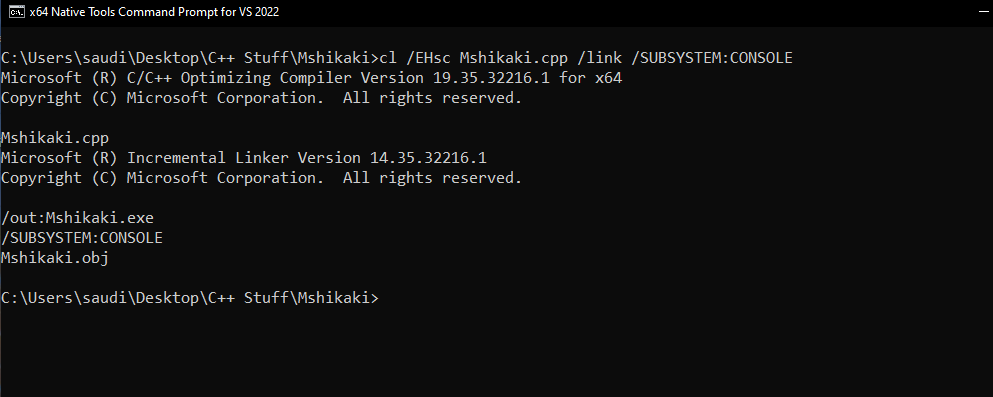
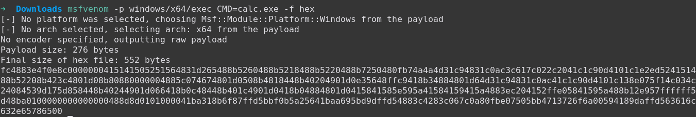
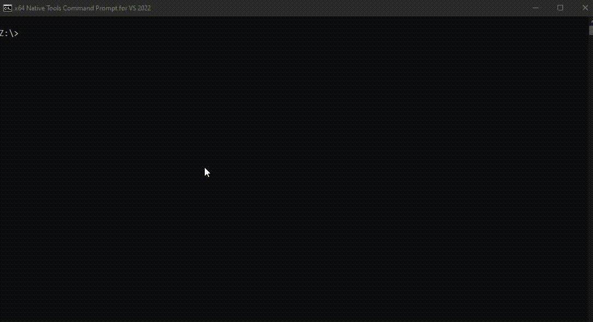

# Mshikaki

"Mshikaki - kebab (skewered meat, especially beef)" yum yum 😋


## Overview
**Mshikaki** is a shellcode injection tool designed to bypass AMSI (Antimalware Scan Interface). It leverages the `QueueUserAPC()` injection technique and offers support for XOR encryption, making it a powerful tool for security researchers and penetration testers.

## Table of Contents
- [Features](#features)
- [Installation](#installation)
- [Usage](#usage)
- [Technical Details](#technical-details)
- [Contribution](#contribution)
- [License](#license)

## Features
- **Bypass AMSI**: Mshikaki is capable of bypassing the Antimalware Scan Interface, allowing for stealthy shellcode execution.
- **QueueUserAPC() Injection**: This technique is used to inject shellcode into a running process, providing a method to execute arbitrary code.
- **XOR Encryption Support**: Enhance the stealthiness of your shellcode by encrypting it with XOR, making detection even more challenging.

## Installation
1. Clone the repository:
```bash
git clone https://github.com/trevorsaudi/Mshikaki.git
```
2. Compile the cpp source code:

- compile on windows using [cl.exe](https://learn.microsoft.com/en-us/cpp/build/walkthrough-compiling-a-native-cpp-program-on-the-command-line?view=msvc-170#open-a-developer-command-prompt) or your preffered compiler. Note that cl.exe is only available if you have installed the Developer Command Prompt for VS or the Microsoft Visual C++ Build Tools
```bash
cl /EHsc Mshikaki.cpp /link /SUBSYSTEM:CONSOLE     
```

## Usage

- Prepare your shellcode and, if desired, encrypt it using XOR.
- The shellcode file should contain hex formatted shellcode as shown below.



- Execute the tool with the necessary arguments:


```bash
Mshikaki.exe -i <path_to_shellcode> 
```

```bash
Mshikaki.exe -i <path_to_shellcode> -p <process_name>

```


- Example with encrypted shellcode


## Technical Details

- **Language:** The tool is written in C++.
- **Injection Technique:** Mshikaki uses the QueueUserAPC() function, a native Windows API, for shellcode injection.
- **Encryption:** The tool supports XOR encryption to obfuscate the shellcode, making it harder for antimalware solutions to detect.

## Contribution

- Contributions to the Mshikaki project are welcome! If you have improvements, bug fixes, or new features to suggest, please create a pull request or open an issue on the GitHub repository.

